<p align="center">
  <h1 align="center">Loyalty Platform</h1>
  <p align="center">Omni-channel Loyalty Management Platform</p>
  <p align="center">全渠道忠诚度管理平台</p>
  <p align="center">
    
    
    
    
    
    
  </p>
</p>

---

## English

### Overview

Loyalty Platform is a **omni-channel loyalty management platform** built for enterprises operating across multiple retail channels (Tmall, JD.com, Douyin, WeChat Mini Programs). It provides a unified member identity system, flexible points accounting engine, rule-driven reward distribution, and visual workflow orchestration.

**Key Capabilities:**
- **Multi-Tenant Isolation** — 4-layer defense: HTTP filter → ORM interceptor → middleware sandbox → query sentinel
- **One-ID Enrollment** — Cross-channel member matching & deduplication (phone/UnionID/UserID)
- **Points Accounting** — FIFO waterfall redemption, negative balance risk control, credit limits
- **Drools Rule Engine** — DRL rules with hot-reload, AI-assisted generation, shadow sandbox regression testing
- **LiteFlow Pipeline** — 7-component event processing chain with visual React Flow designer & hot-reload
- **Schema-Driven UI** — Dynamic entity model (JSONB ext_attributes) with REST API auto-generation
- **Cascade Recalculation** — Lock-free compensation for tier changes triggered by points adjustments

### Architecture

```
Frontend (React 18 + TypeScript + Ant Design 5)
  Dashboard | Rule Editor | Flow Designer | Schema Editor | ...
        │ REST API (/api/*)
        ▼
Backend (Spring Boot 3.2.5 + Java 17)
  SPI Gateway ──→ LiteFlow Pipeline (7 components)
  Drools Rules ──→ Points Accounting (FIFO + Waterfall)
  Cascade Recalculation ──→ Security (RBAC + JWT + Quota)
        │
        ▼
Data Layer: PostgreSQL 15+ (JSONB) | Redis 6.x+ | Kafka (optional)
```

### Tech Stack

| Layer | Technology |
|-------|-----------|
| Backend Framework | Spring Boot 3.2.5, Java 17 |
| ORM | Hibernate 6.4 + JPA, MyBatis-Plus 3.5.6 |
| Rule Engine | Drools 8.44.2 (KieBase Cache, StatelessKieSession) |
| Flow Orchestration | LiteFlow 2.12.4 (7 components, EL chain, hot-reload) |
| Scripting | GraalVM Polyglot (JavaScript sandbox) |
| Database | PostgreSQL 15+ (JSONB, RLS, pg_partman) |
| Cache | Redis 6.x+ (Redisson 3.30) |
| Messaging | Kafka (optional, dev uses LocalEventBus) |
| Frontend | React 18, TypeScript, Ant Design 5 |
| Flow Designer | @xyflow/react (React Flow 11.x), Zustand |
| Code Editor | Monaco Editor |
| Testing | JUnit 5, Mockito, Playwright (E2E) |


### Project Structure

```
src/main/java/com/loyalty/platform/
├── accounting/         Points grant, redeem, compaction, negative risk
├── admin/              AdminController (programs, rules, flows, audit)
├── api/                REST controllers & services
├── cascade/            Cascade recalculation engine
├── common/             Shared utilities (cache, context, event, exception, filter, interceptor)
├── config/             Hibernate, MyBatis-Plus, RLS, Tenant configs
├── domain/             JPA entities, enums, converters, repositories
├── event/              EventInboxProcessor (state machine)
├── flow/               ** LiteFlow pipeline (7 components + EventContext + EventController)
├── job/                Scheduled jobs (TierEval, Compaction, Merge, Retry)
├── mapping/            ScriptingTransformer (GraalVM)
├── member/             OneIdEnrollmentService, MemberMergeService
├── notification/       Outbox, SMS, WeChat providers
├── rules/              Drools rule engine (Action, DRL, regression)
├── security/           RBAC, JWT, QuotaBillingSentinel, AuditMonitor
└── spi/                SPI gateway (TMALL, JD, DOUYIN, WECHAT handlers)
```

### v7.3 Features

- **LiteFlow Pipeline** — 7-component event chain + React Flow visual designer
- **Package Restructure** — `com.loyalty.saas` → `com.loyalty.platform`
- **Rule Engine API** — 11 endpoints for rule CRUD, publish, sandbox, DRL test
- **Member Merge Saga** — Async merge with MergeTaskJob (SKIP LOCKED)
- **TenantKeyGenerator** — Tenant-aware Redis key generation
- **Event Time Extraction** — Multi-format business event time parsing
- **KieBase Draft Compilation** — `buildKieBaseWithDraft()` for shadow sandbox


### Screenshots

**会员服务 / Member Service**

| 截图 | 说明 |
|------|------|
| 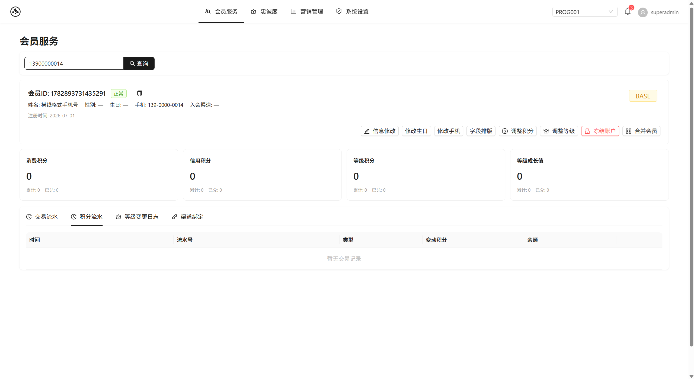 | **会员服务** / Member Service — 会员查询、积分账户、交易流水、渠道绑定 |

**忠诚度配置 / Loyalty Configuration**

| 截图 | 说明 |
|------|------|
| 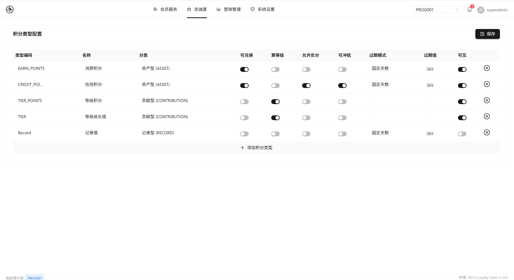 | **1. 积分类型配置** / Point Type Configuration |
| 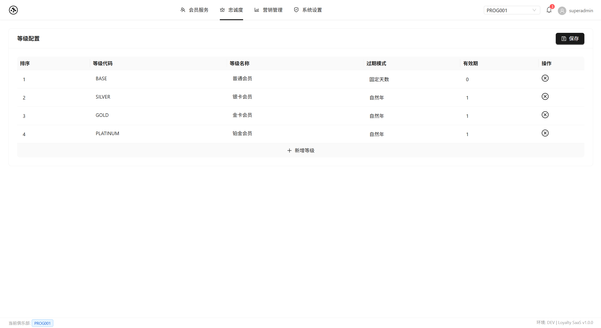 | **2. 等级划分配置** / Tier Level Configuration |
| 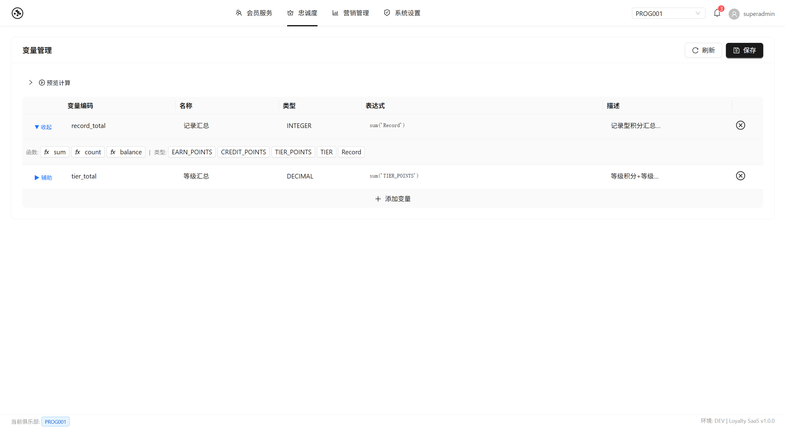 | **3. 变量配置** / Variable Configuration |
| 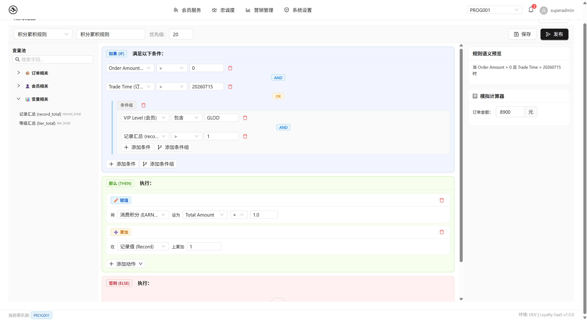 | **4. 积分累积规则配置** / Point Earning Rule Configuration |
| 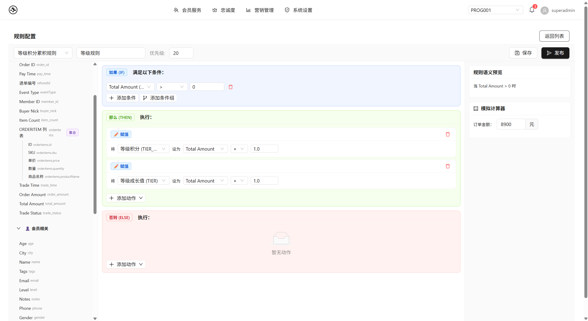 | **5. 等级积分配置** / Tier Points Configuration |
| 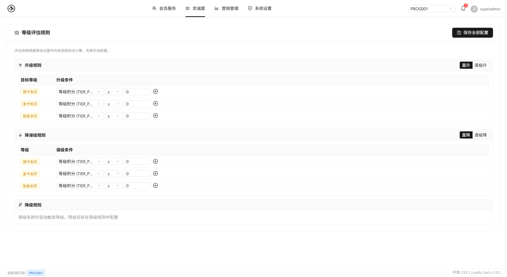 | **6. 等级评估配置** / Tier Evaluation Configuration |
| 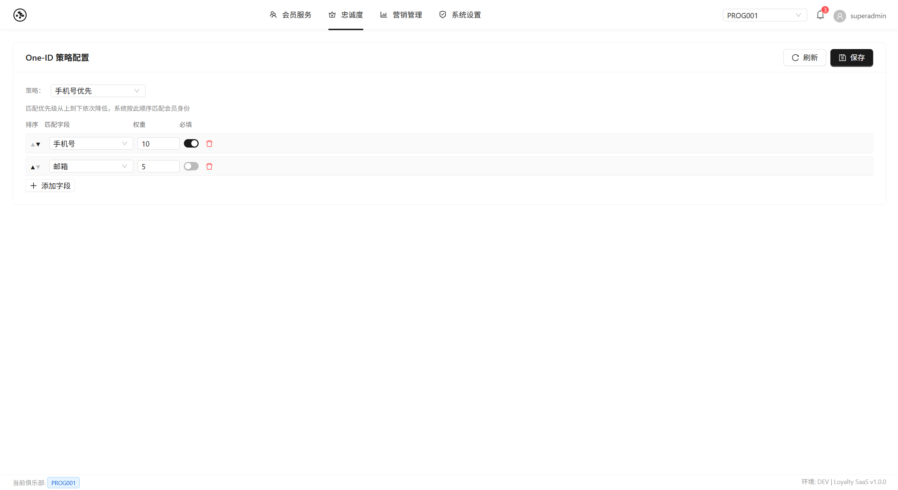 | **7. One-ID 策略配置** / One-ID Strategy Configuration |

**系统管理 / System Administration**

| 截图 | 说明 |
|------|------|
| 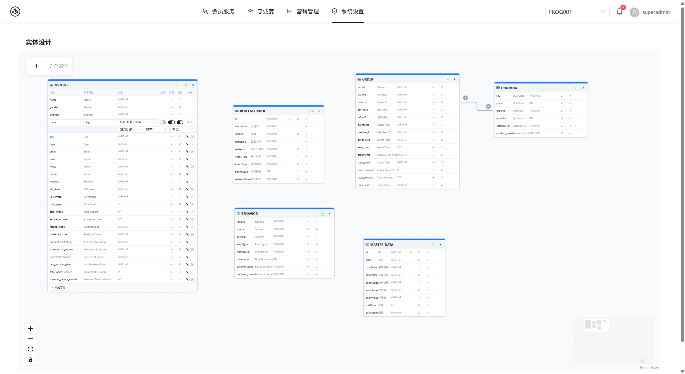 | **实体模型配置** / Entity Model Configuration |
| 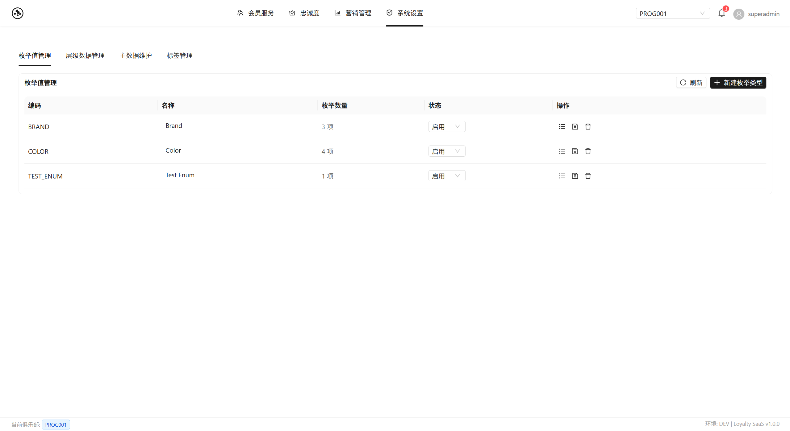 | **主数据管理** / Master Data Management |
| 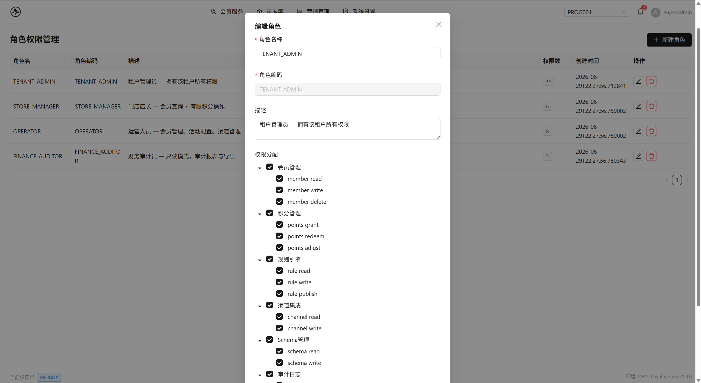 | **角色管理** / Role Management |
| 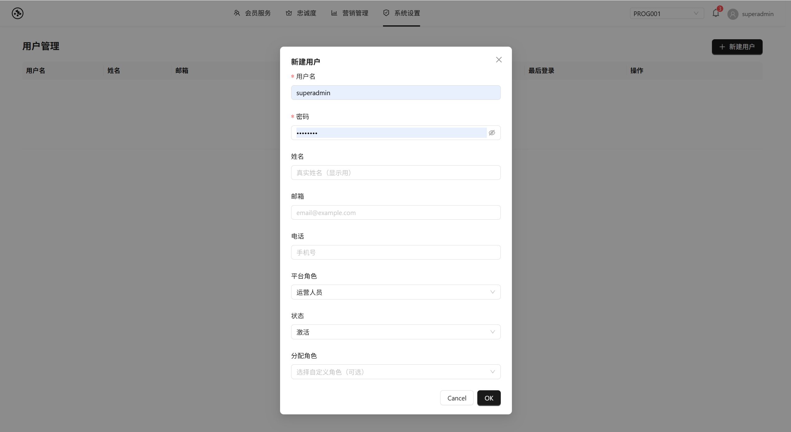 | **用户管理** / User Management |

---

---

## 中文

### 概述

Loyalty Platform 是一个**全渠道忠诚度管理平台**，面向跨零售渠道（天猫、京东、抖音、微信小程序）运营的企业。提供统一的会员身份体系、灵活的积分账务引擎、规则驱动的奖励分发和可视化流程编排。

**核心能力：**
- **多租户强隔离** — 四层防御体系：入口过滤 → ORM 拦截 → 中间件沙箱 → 查询哨兵
- **One-ID 入会** — 跨渠道会员匹配与去重（手机号/UnionID/UserID）
- **积分账务** — FIFO 瀑布流冲抵、负分风险控制、授信额度管理
- **Drools 规则引擎** — DRL 规则热更新、AI 辅助生成、影子沙箱回归测试
- **LiteFlow 流水线** — 7 组件事件处理链 + React Flow 可视化设计器 + 热更新
- **Schema-Driven UI** — 动态实体模型（JSONB ext_attributes）+ REST API 自动生成
- **级联重算** — 等级变更触发积分无锁化补偿

### 架构

```
前端 (React 18 + TypeScript + Ant Design 5)
  Dashboard | Rule Editor | Flow Designer | Schema Editor | ...
        │ REST API (/api/*)
        ▼
后端 (Spring Boot 3.2.5 + Java 17)
  SPI 网关 ──→ LiteFlow 流水线 (7 组件)
  Drools 规则 ──→ 积分账务 (FIFO + 瀑布流)
  级联重算 ──→ 安全 (RBAC + JWT + 配额)
        │
        ▼
数据层: PostgreSQL 15+ (JSONB) | Redis 6.x+ | Kafka (可选)
```

### 技术栈

| 层级 | 技术 |
|------|------|
| 后端框架 | Spring Boot 3.2.5, Java 17 |
| ORM | Hibernate 6.4 + JPA（主）, MyBatis-Plus 3.5.6 |
| 规则引擎 | Drools 8.44.2（KieBase 缓存, StatelessKieSession） |
| 流程编排 | LiteFlow 2.12.4（7 组件, EL 链, 热更新） |
| 脚本引擎 | GraalVM Polyglot（JavaScript 沙箱） |
| 数据库 | PostgreSQL 15+（JSONB, RLS, pg_partman） |
| 缓存 | Redis 6.x+（Redisson 3.30） |
| 消息队列 | Kafka（可选，开发环境使用 LocalEventBus） |
| 前端 | React 18, TypeScript, Ant Design 5 |
| 流程设计器 | @xyflow/react（React Flow 11.x）, Zustand |
| 代码编辑器 | Monaco Editor |
| 测试 | JUnit 5, Mockito, Playwright（E2E） |


### 项目结构

```
src/main/java/com/loyalty/platform/
├── accounting/         积分发放、兑换、压缩、负分风控
├── admin/              AdminController（Program、规则、流程、审计）
├── api/                REST 控制器与服务
├── cascade/            级联重算引擎
├── common/             公共工具（缓存、上下文、事件、异常、过滤器、拦截器）
├── config/             Hibernate, MyBatis-Plus, RLS, Tenant 配置
├── domain/             JPA 实体、枚举、转换器、仓储
├── event/              EventInboxProcessor（状态机）
├── flow/               ** LiteFlow 流水线（7 组件 + EventContext + EventController）
├── job/                定时任务（等级评估、积分压缩、合并、重试）
├── mapping/            ScriptingTransformer（GraalVM 脚本）
├── member/             OneIdEnrollmentService, MemberMergeService
├── notification/       消息推送（Outbox, SMS, 微信）
├── rules/              Drools 规则引擎（Action, DRL, 回归测试）
├── security/           RBAC, JWT, QuotaBillingSentinel, AuditMonitor
└── spi/                SPI 网关（天猫/京东/抖音/微信处理器）
```

### v7.3 新特性

- **LiteFlow 流水线** — 7 组件事件处理链 + React Flow 可视化设计器
- **包结构重构** — `com.loyalty.saas` → `com.loyalty.platform`
- **规则引擎 API** — 11 个新端点：规则 CRUD、发布、沙箱验证、DRL 测试
- **会员合并 Saga** — 异步合并 + MergeTaskJob（SKIP LOCKED 并发安全）
- **TenantKeyGenerator** — 租户感知 Redis Key 生成器
- **事件时间提取** — 多格式业务时间解析（pay_time、trade、Unix 时间戳）
- **草稿规则编译** — `buildKieBaseWithDraft()` 支持影子沙箱回归


### License

MIT